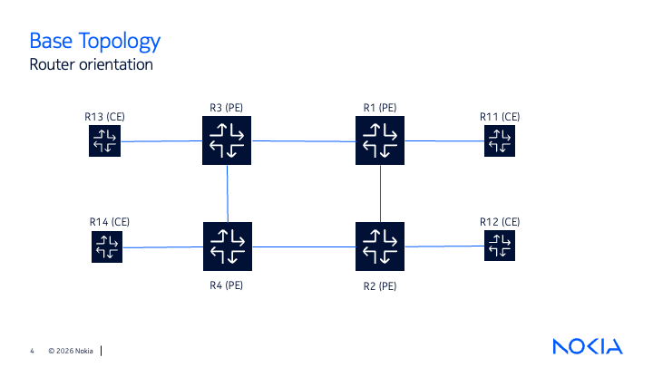
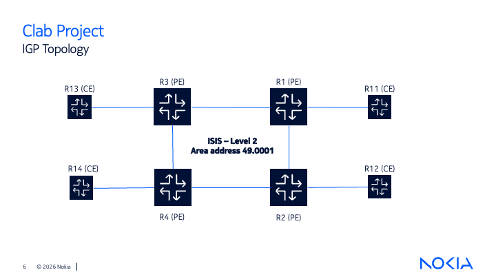
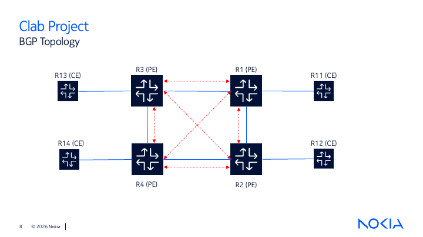
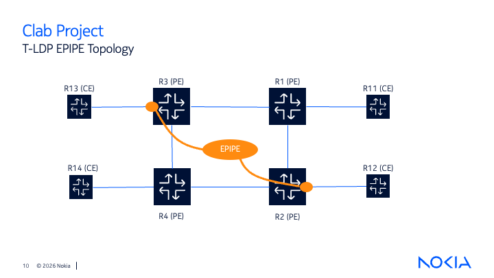
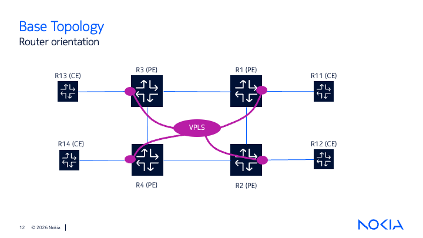

# Service Provider Network Solution Demo

## Overview

This project demonstrates a simulated service provider network built using **Containerlab**, and highlights Nokia’s MPLS‑based service‑delivery platform and seamless integration of Layer 2 and Layer 3 VPN technologies.

The topology below reflects the actual network in a condensed, lab‑grade format. It preserves the core structure and key relationships, but is streamlined for easier analysis, demonstration and discussion.

The solution demonstrates:

- MPLS-based transport network
- ISIS Level-2 as the IGP underlay
- iBGP between PE routers for service control
- VPLS Layer 2 VPN services
- EPIPE point-to-point Layer 2 connectivity
- VPRN Layer 3 VPN services

---

# Network Architecture

## Base Topology



The physical topology consists of four Provider Edge (PE) routers interconnected to form an MPLS provider network, with multiple Customer Edge (CE) routers representing customer locations.

The PE routers provide service connectivity while maintaining customer separation and allowing multiple services to operate over a shared provider infrastructure.

---

# Provider Underlay

## ISIS Level-2 Underlay



The PE routers use **ISIS Level-2** as the underlay routing protocol.

ISIS provides:

- PE loopback reachability
- IP connectivity between provider nodes
- Routing information required for MPLS transport

Configuration:

```
Area: 49.0001
Level: Level-2
```

All PE routers participate in the same ISIS domain.

---

# MPLS Control Plane

## iBGP Between PE Routers



The PE routers establish iBGP sessions to exchange service-related routing information.

BGP provides:

- VPN route exchange
- Customer route distribution
- Service scalability between PE routers

The PE loopback addresses are used as BGP endpoints.

---

# Customer Connectivity Services

## VPWS/EPIPE - Point-to-Point Layer 2 Service



The EPIPE service provides a dedicated point-to-point Ethernet connection between customer locations.

Configured service path:

```
CE13 ---- PE3 ==== MPLS Transport ==== PE2 ---- CE12
```

Implementation:

- Service type: Point-to-point Ethernet circuit
- Signaling: Targeted LDP (T-LDP)
- Transport: MPLS pseudowire

Common use cases:

- Dedicated Ethernet circuits
- Private site-to-site connectivity
- Legacy service replacement

VPWS allows customers to extend private Layer 2 connectivity between locations over a shared MPLS provider network.

---

## VPLS - Layer 2 VPN



VPLS provides multipoint Layer 2 connectivity between customer sites across the MPLS provider network.

Characteristics:

- Multipoint Ethernet connectivity
- Customer Layer 2 extension across the provider network
- MAC learning between PE routers
- Traffic separation from other services

VPLS allows geographically separated customer sites to operate as if they were connected to the same local Ethernet network.

---

# Layer 3 Services


## VPRN - Layer 3 VPN


The VPRN service provides routed Layer 3 connectivity between customer sites.

Features:

- Customer route isolation
- Independent routing domains
- MP-BGP VPN route exchange
- MPLS-based traffic transport

VPRN allows multiple customers to share the same provider infrastructure while maintaining complete logical separation.

---

# Solution Summary

This demonstration shows how a service provider can use MPLS technologies to deliver multiple connectivity solutions over a common network infrastructure.

| Technology | Purpose |
|------------|---------|
| ISIS | Provider network underlay routing |
| MPLS | Transport infrastructure |
| iBGP | Service route distribution |
| VPLS | Multipoint Layer 2 VPN |
| EPIPE | Point-to-point Layer 2 VPN |
| VPRN | Layer 3 VPN |

---
# Repository Structure

```text
.
├── README.md
├── .tls/                              # TLS certificates generated by Containerlab
├── R1/                                # Router R1 startup configuration
├── R2/
├── R3/
├── R4/
├── R11/
├── R12/
├── R13/
├── R14/
├── clab-rapha-project/                # Containerlab runtime artifacts
├── ansible-inventory.yml              # Ansible inventory
├── authorized_keys                    # SSH public keys
├── license_srsim.txt                  # Nokia SR Linux license
├── nornir-simple-inventory.yml        # Nornir inventory
├── rapha-project.clab.yml             # Containerlab topology definition
├── rapha-project.clab.yml.annotated.yaml  # Auto-generated annotated topology
└── topology-data.json                 # Topology metadata

```

# Deployment

Deploy the topology:

```bash
clab deploy
```

Destroy the topology:

```bash
clab destroy
```

---

# Verification

The following commands are used to verify the operation of the provider network, MPLS transport, control plane protocols, and customer services.

---

# Base Topology (Ports and Interfaces)

These commands verify the physical topology, hardware components, port status, and interface connectivity.

```
show card
show mda
show port
show router interface
```

Basic IP connectivity can be tested using:

```
ping <ip-address>
traceroute <ip-address>
```

---

# Provider Underlay

## ISIS

ISIS provides the IGP underlay for the provider network. It is responsible for advertising PE loopback addresses and providing IP reachability between PE routers.

Verify ISIS neighbor relationships:

```
show router isis adjacency
```

Verify ISIS operational status and interfaces:

```
show router isis 0
show router isis interface
```

Verify learned routes:

```
show router route-table
```

Test reachability between provider nodes:

```
ping <ip-address>
traceroute <ip-address>
```

---

# Service Control Plane

## BGP

iBGP is used between PE routers to exchange service-related routing information. This includes customer VPN routes used by VPRN services.

Verify PE-to-PE BGP sessions:

```
show router bgp summary all
```

A successful deployment should show established BGP sessions between PE routers.

---

# MPLS Transport

## LDP / Targeted LDP (T-LDP)

LDP provides MPLS label distribution between PE routers.

Targeted LDP (T-LDP) is used for signaling pseudowires between PE routers. These pseudowires provide the transport mechanism for Layer 2 services such as VPWS/EPIPE.

Verify LDP and T-LDP sessions:

```
show router ldp session
```

Verify MPLS label bindings:

```
show router ldp bindings
```

These commands confirm that PE routers are exchanging labels and that MPLS transport is available.

---

# Service Mapping

The following service IDs and SDP associations are used within this lab.

| Service | Type | Service ID | PE Nodes |
|---------|------|------------|----------|
| EPIPE | Point-to-Point Layer 2 VPN | 20 | PE2 ↔ PE3 |
| VPLS | Multipoint Layer 2 VPN | 100 | PE1, PE2, PE3, PE4 |
| VPRN | Layer 3 VPN | ??? | PE1, PE2, PE3, PE4 |

---

## SDP Transport Mapping

SDP identifiers are locally significant on each PE router. The same service
connection may use different SDP IDs depending on the PE where the service is
viewed.

For example, the EPIPE service between PE2 and PE3 uses:
```text
PE2                         PE3

SDP 3  ==================  SDP 2
           PSEUDOWIRE
```

For VPLS and VPRN services, each PE uses SDPs toward the other PE routers to
provide PE-to-PE service connectivity. The SDP number corresponds to the remote
PE association on that specific router.

# Layer 2 Services

## VPWS / EPIPE (Point-to-Point Layer 2 VPN)

EPIPE is Nokia's implementation of a VPWS service. It provides a point-to-point Layer 2 Ethernet connection between customer sites.

The service uses a T-LDP signaled pseudowire between PE routers.

Service path configured in this lab:

```
CE12 ---- PE2 ==== MPLS Transport ==== PE3 ---- CE13
```

Verify EPIPE service status:

```
show service id 10 base
```

Verify service labels:

```
show service id 10 labels
```

Verify customer attachment points:

```
show service sap-using
```

Verify service transport paths:

```
show service sdp <sdp-id> (sdp-id: 2 or 3)
```

To demonstrate connectivity between CEs:

```
ping 192.168.30.2 (from CE3, to CE2)
ping 192.168.30.3 (from CE2, to CE3)
```
---

## VPLS (Multipoint Layer 2 VPN)

VPLS provides multipoint Layer 2 connectivity between customer sites over the MPLS provider network.

It allows multiple customer locations to communicate as if they were connected to the same Ethernet segment.

Verify VPLS service status:

```
show service id 100
show service id 100 base
```

Verify MPLS service transport:

```
show service sdp <sdp-id> (sdp-id: 1-4)
```

Verify customer-facing interfaces:

```
show service sap-using
```

To demonstrate connectivity between CEs:

```
ping 10.10.1.11 (from any CE to get to CE1)
ping 10.10.1.12 (from any CE to get to CE2)
ping 10.10.1.13 (from any CE to get to CE3)
ping 10.10.1.14 (from any CE to get to CE4)
```
---

# Layer 3 Services

## VPRN (Layer 3 VPN)

VPRN provides routed Layer 3 VPN connectivity between customer sites.

The service uses MPLS transport and BGP VPN route exchange to provide customer route isolation and scalable multi-tenant connectivity.

Verify VPRN service status:

```
show service id <service-id>
```

---

# Conclusion

 Using Containerlab, this project models a service‑provider MPLS network that illustrates Nokia’s robust service‑delivery platform and the tight coupling of Layer 2 and Layer 3 VPN technologies. 
